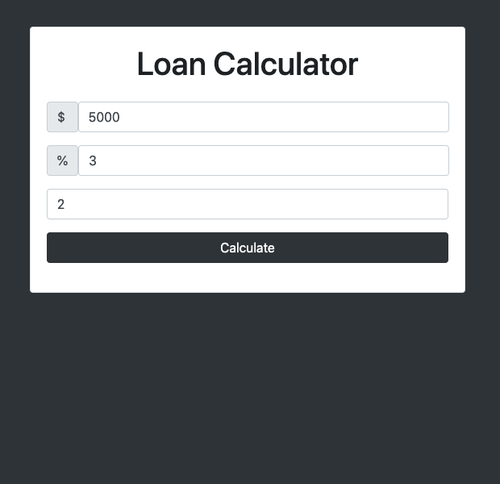
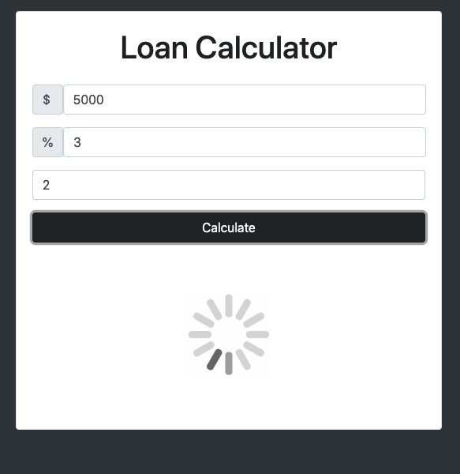
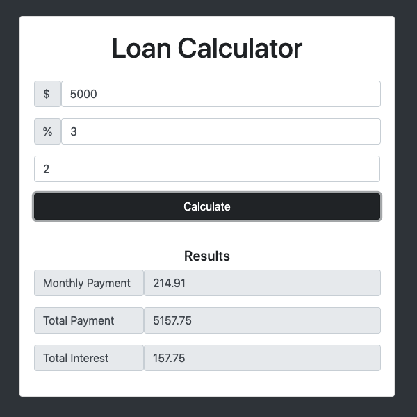
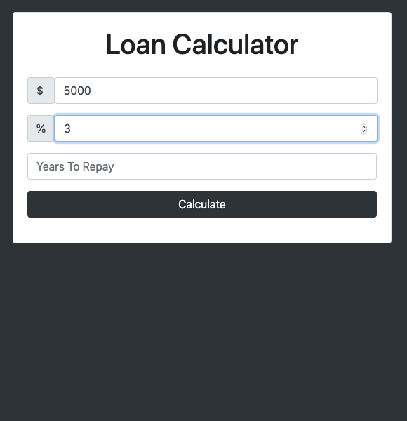
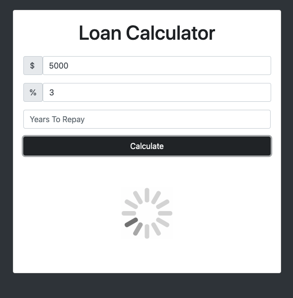
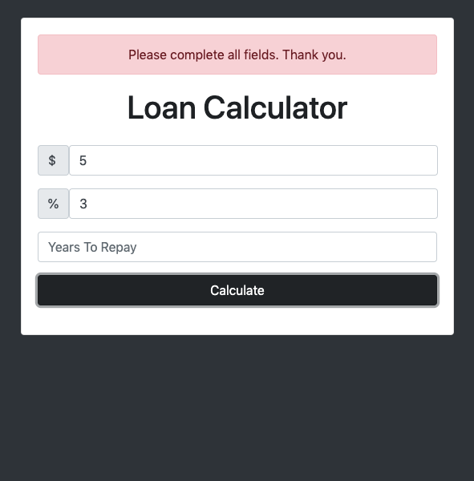

# JS.LoanCalculator

#### _May 2020_

#### By _**Marc Davies**_

# Table of Contents

<!--ts-->

- [Description](#description)
- [Technologies Used](#technologies-used)
- [Setup and Installation](#setup-and-installation)
- [Known Bugs](#known-bugs)
- [Support And Contact Details](#support-and-contact-details)
<!--te-->

## Description

Application which takes 3 inputs from the user:

- Loan Amount
- Interest
- Years To Repay

With those numbers, the application will calculate and display to user:

- Monthly Payment
- Total Payment
- Total Interest

UI/UX elements: Spinning loader to simulate calculation, alert if application cannot calculate.

See User Stories below for more information.

## Technologies Used

- _HTML 5_
- _CSS 3_
- _Bootstrap 4.5.0_
- _Javascript_

## Setup and Installation

- Launch your terminal.
- `cd desktop` Navigate to the desktop.
- `git clone "https://github.com/MarcLignarius/JS.LoanCalculator"` Clone this repository to your desktop.
- `cd JS.LoanCalculator` Open up the cloned repository.
- `open index.html` to open the application in your browser.

Alternatively, visit https://marclignarius.github.io/JS.LoanCalculator/ to see the live version of the application.

## User Stories

### Calculating payments

|         User Inputs          |       App Calculations       |       App Confirmation       |
| :--------------------------: | :--------------------------: | :--------------------------: |
|  |  |  |

### Error Handling

|         User Inputs          |       App Calculations       |          App Alert           |
| :--------------------------: | :--------------------------: | :--------------------------: |
|  |  |  |

## Known Bugs

There are no known bugs as of that last release.

## Support and Contact Details

Please contact me via <a href="https://www.linkedin.com/in/marcdaviesriot/">LinkedIn</a> if you have any questions. Your feedback is always welcomed!

Copyright (c) 2020 **_Marc Davies_**
